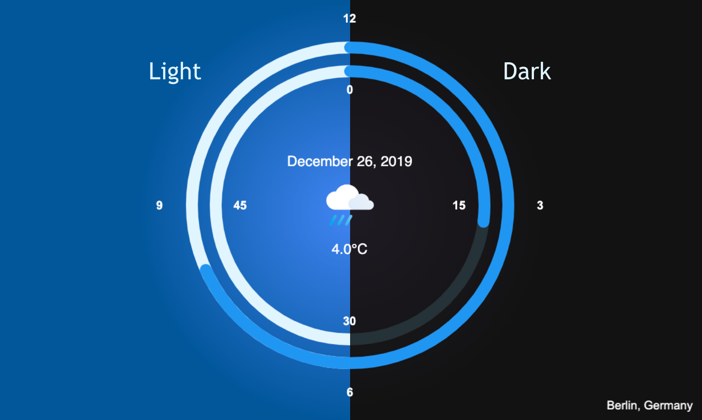

# Flutter Clock Challange
### Taked the Flutter Clock challange

||||--|--|

Light             |  Dark
:-------------------------:|:-------------------------:
  |  

## Flutter Clock

Welcome to Flutter Clock!

See [flutter.dev/clock](https://flutter.dev/clock) for how to get started, submission requirements, contest rules, and FAQs.

See a [live demo](https://maryx.github.io/flutter_clock) with Flutter for Web!

Example [Analog Clock](analog_clock)

Example [Digital Clock](digital_clock)

