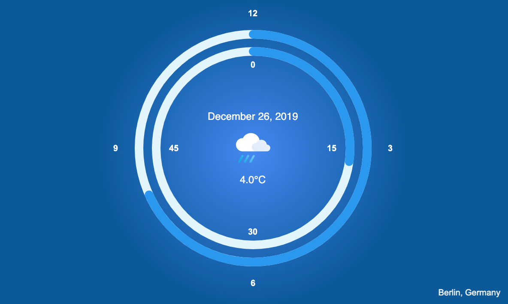
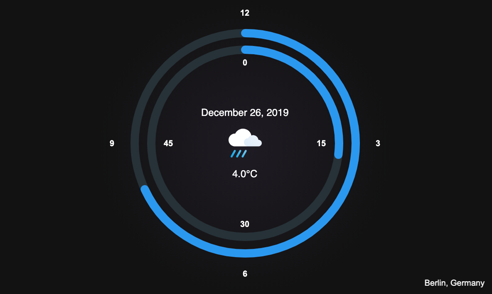

# Flutter Clock Challange
### Taked the Flutter Clock challange
https://flutter-clock-e8492.firebaseapp.com/#/

<b>Outer</b> ring is the <b>hour</b> hand. <b>Inner</b> ring shows the <b>minutes</b>.
 Central in the clock are the informations for current date and weather data. 
 Additionally, the current location is shown in the lower right corner.

Light             |  Dark
:-------------------------:|:-------------------------:
  |  

#### ko_fi: https://ko-fi.com/berger
#### buymeacoffee: https://www.buymeacoffee.com/RW5zuJI

## Flutter Clock

Welcome to Flutter Clock!

See [flutter.dev/clock](https://flutter.dev/clock) for how to get started, submission requirements, contest rules, and FAQs.

See a [live demo](https://maryx.github.io/flutter_clock) with Flutter for Web!

Example [Analog Clock](analog_clock)

Example [Digital Clock](digital_clock)

